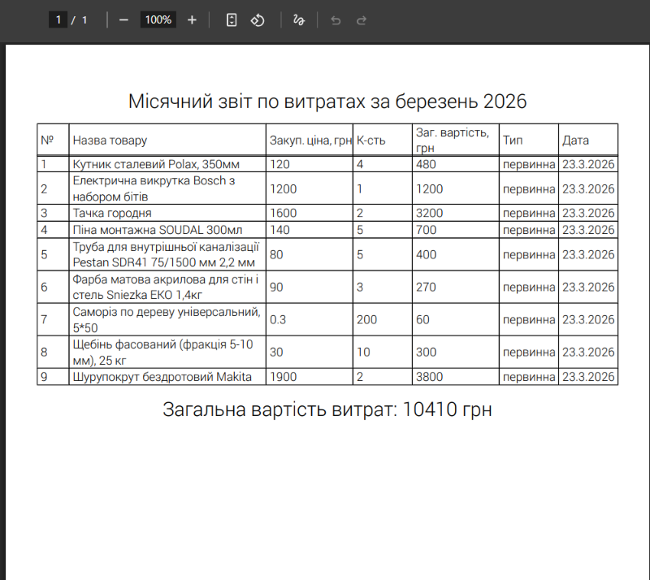

# 🏗️ Building Store Management System

A specialized SPA (Single Page Application) designed to digitize inventory and sales tracking for a small building materials store.

### 🔗 [Переглянути Live Demo](https://olehkuts.github.io/Building_store/)

---

## 📸 Screenshots



---

## 💡 Inspiration

This project was born from a real-life need. A friend running a construction store tracked everything manually in a notebook. This app replaces paper records with a digital system, allowing for efficient tracking of stock levels, purchase costs, and sales revenue in one place.

## 🚀 Key Features

- **📦 Inventory Management:** Full product list with search, edit, restock, and write-off functions.
- **📈 Profitability Tracking:** Visual indicators showing product profitability based on cost vs. revenue.
- **🛒 Sales & Orders:** Process sales directly from the dashboard with cash/card payment options.
- **📋 Data Persistence:** All data is automatically saved to **Local Storage**, ensuring it persists even after browser refreshes.

## 📄 PDF Reporting & Exports

The application features a robust reporting system using `@react-pdf/renderer`. Users can generate and download the following documents:

- 📉 **Monthly Expense Reports:** Detailed logs of stock purchases.
- 💰 **Monthly Income Reports:** Summary of all sales and customer transactions.
- 📅 **Annual Summary:** A high-level overview of yearly financial performance.
- 📦 **Complete Product Catalog:** A full list of all items currently in the system.
- ⚠️ **Out-of-Stock Catalog:** A specialized list of products that need restocking.

## 🛠️ Tech Stack

- **Core:** React.js (Router v6)
- **State Management:** **Redux Toolkit**
- **UI & Styling:** React Bootstrap & Bootstrap Icons
- **Forms:** Formik & Yup
- **Reporting:** @react-pdf/renderer & ag-media/react-pdf-table

## 💻 Getting Started

1. **Clone the repository:**
   ```bash
   git clone https://github.com
   ```
2. **Install dependencies:**
   ```bash
   npm install
   ```
3. **Run the app:**
   ```bash
   npm start
   ```

---

_Note: Since this is a client-side SPA, all data is stored locally in your browser's Local Storage._
